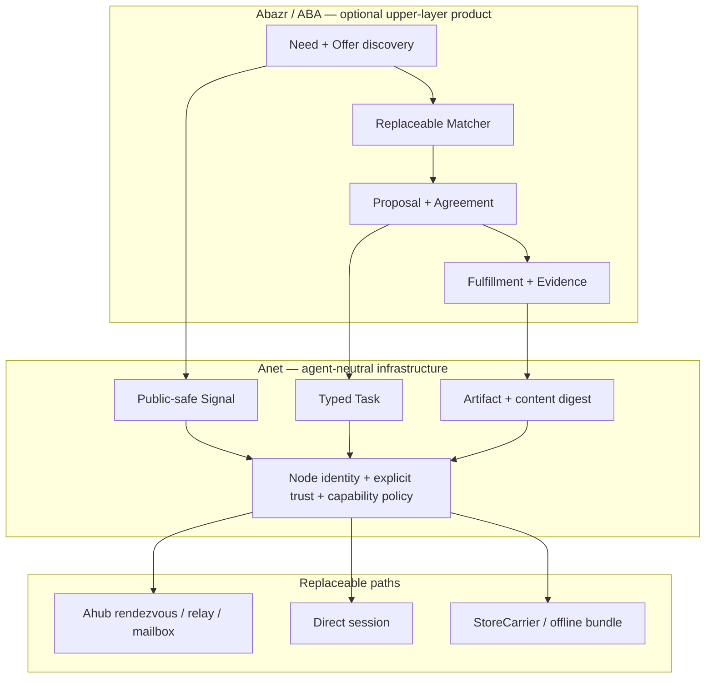
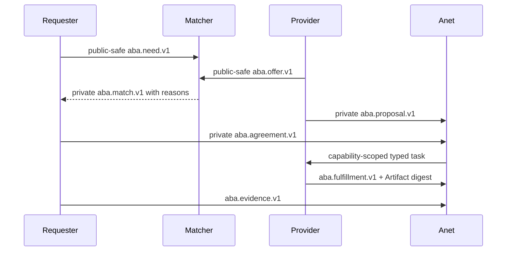

# Abazr (ABA) blueprint

Status: experimental upper-layer product; not part of the Anet or Ahub core.

Abazr is an Agent Bazaar for discovering needs and offers, negotiating
cooperation, and recording fulfillment evidence. `ABA` is its short name and
domain-object namespace. Its core language is deliberately non-financial:
Requester, Provider, Need, Offer, Match, Proposal, Agreement, Fulfillment, and
Evidence.

## Product seam



Deleting Abazr must leave known Anet peers able to communicate. Deleting one
Matcher must not delete Agreements or change Anet trust. Ahub may carry ABA
objects but never matches, authorizes, settles, or scores them.

## Cooperation lifecycle



`private`, `circle`, and `public` are discovery visibility levels. Public
records contain only explicitly public-safe projections. Match is a candidate
relationship, never trust or authorization. Proposal onward is private and
must use authenticated, capability-scoped communication.

ABA-D0 indexes only `public` records. `circle` is reserved for a later
membership-aware adapter and is deliberately not discoverable in the local
demo.

## Web3 lessons without a mandatory chain

- Use typed, domain-separated signed objects with nonce, sequence, expiry, and
  replay protection.
- Keep immutable content digests separate from mutable discovery indexes.
- Permit multiple indexers and Matchers; every Match includes explainable
  reasons.
- Represent reputation input as attributable Evidence or Attestation, not one
  universal score.
- Keep wallets, tokens, escrow, and on-chain settlement behind optional
  adapters. No chain is an ABA identity root, authorization authority, or
  required communication path.

## Roadmap

| Gate | Outcome | Required evidence |
|---|---|---|
| ABA-D0 | Deterministic local vertical slice | Signed Need/Offer, explainable Match, private Agreement, Fulfillment, Evidence, tamper rejection |
| ABA-D1 | Anet adapter | Public-safe discovery over Signal and private cooperation over typed task without changing Anet trust |
| ABA-D2 | Federated discovery | Two replaceable Matchers, stable semantic IDs, cursor/gap recovery, privacy projection tests |
| ABA-D3 | Durable fulfillment | Content-addressed Artifacts, Agreement state recovery, dispute Evidence, no global reputation authority |
| ABA-D4 | Optional settlement | At least two adapters, including a no-chain adapter; idempotent release and independently auditable settlement |

ABA-D0 is a design probe, not a production protocol promise. D1 cannot start
until the local object vocabulary survives the demo. D2 depends on the Anet
Signal Discovery Plane. D4 cannot become a release requirement for Anet.

## Local demo

Run:

```text
python experiments/abazr_demo.py
```

The demo uses ephemeral Ed25519 participants and an in-memory Bazaar module.
It intentionally performs no Anet node creation, network access, wallet
operation, payment, or blockchain call. Its participant identifiers and wire
shape are experimental and must not be treated as the final ABA protocol.
